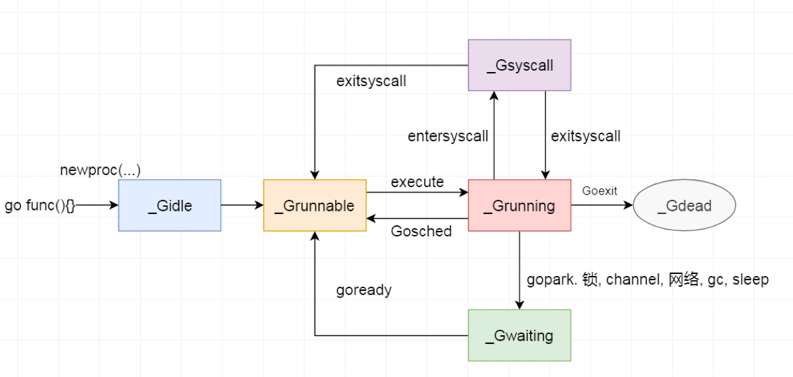

# OS调度

## 基本概念

以线程为调度的基本单位，利用调度算法来进行明智的决策，从而减少调度延迟

## 线程

### 线程的状态

- **Waiting**: 这意味着线程已停止并等待某些事情才能继续。这可能是因为等待硬件（磁盘、网络）、操作系统（系统调用）或同步调用（原子、互斥）等原因。这些类型的延迟是性能不佳的根本原因。
- **Runable**: 这意味着线程需要内核上的时间，以便它可以执行分配给它的机器指令,如果你有很多线程需要时间，那么线程必须等待更长的时间才能获得时间。此外，随着更多线程争夺时间，任何给定线程获得的单独时间都会缩短。这种类型的调度延迟也可能是导致性能不佳的原因。
- **Running**: 这意味着线程已放置在核心上并正在执行其机器指令。按照每个程序希望的，应用程序正在完成相关工作。

### 线程的工作方式

- **CPU密集型**: 这项工作永远不会造成线程可能处于等待状态的情况. 这是一项不断进行计算的工作
- **IO密集型**：这是导致线程进入等待状态的工作。这项工作包括通过网络请求访问资源或对操作系统进行系统调用。如我们访问数据库，进行同步事件（互斥体、原子），这会导致线程进入等待。

### 线程的上下文切换

#### 基本概念

在CPU核心上交换线程的物理行为称为上下文切换。发生上下文切换是在当调度程序从内核中取出一个 Executing 线程并用一个 Runnable Thread 替换它时。从运行队列中选择的线程进入 Executing 状态，被取出的线程可以移回 Runnable 状态（如果它仍然具有运行能力），或进入 Waiting 状态（如果由于 IO-Bound 类型的请求而被替换）。

#### 缺点

上下文切换资源消耗严重，因为在内核上和内核外交换线程需要时间。上下文切换过程中产生的延迟量取决于不同的因素，但花费约1000到约1500纳秒的时间。硬件在平均情况下，在每个核上每纳秒执行12条指令，上下文切换可能会花费约12k到约18k条指令的延迟。本质上，您的程序在上下文切换时正在失去大量执行指令的能力

# Goroutine
## 基本概念
Go 语言调度器中待执行的任务，它在运行时调度器中的地位与线程在操作系统中差不多，但是它占用了更小的内存空间，也降低了上下文切换的开销。Goroutine 只存在于 Go 语言的运行时，它是 Go 语言在用户态提供的线程，作为一种粒度更细的资源调度单元，如果使用得当能够在高并发的场景下更高效地利用机器的CPU.
## 优势
- 内存占用小,一个G 2KB左右，可以大量开辟Goroutine
- 在**用户层**可以灵活调度,调度切换开销小

## 状态
- _**Gidle**: 刚刚被分配并且还没有被初始化
- _**Grunnable**: 没有执行代码，没有栈的所有权，存储在运行队列中
- _**Grunning**: 可以执行代码，拥有栈的所有权，被赋予了内核线程 M 和处理器 P
- _**Gsyscall**: 正在执行系统调用，拥有栈的所有权，没有执行用户代码，被赋予了内核线程 M 但是不在运行队列上
- _**Gwaiting**: 由于运行时而被阻塞，没有执行用户代码并且不在运行队列上，但是可能存在于 Channel 的等待队列上
- _**Gdead**: 没有被使用，没有执行代码，可能有分配的栈
- _**Gcopystack**: 栈正在被拷贝，没有执行代码，不在运行队列上
- _**Gpreempted**: 由于抢占而被阻塞，没有执行用户代码并且不在运行队列上，等待唤醒
- _**Gscan**: GC 正在扫描栈空间，没有执行代码，可以与其他状态同时存在

### 状态切换

状态简化(跟线程是一样的)
   - **waiting**: Goroutine 正在等待某些条件满足，例如：系统调用结束等，包括 _Gwaiting、_Gsyscall 和 _Gpreempted 几个状态
   - **runnable**: Goroutine 已经准备就绪，可以在线程运行，如果当前程序中有非常多的 Goroutine，每个 Goroutine 就可能会等待更多的时间，即 _Grunnable
   - **running**: Goroutine 正在某个线程上运行，即 _Grunning

## 推荐阅读

[scheduling-in-go-part](https://www.ardanlabs.com/blog/2018/08/scheduling-in-go-part1.html)

