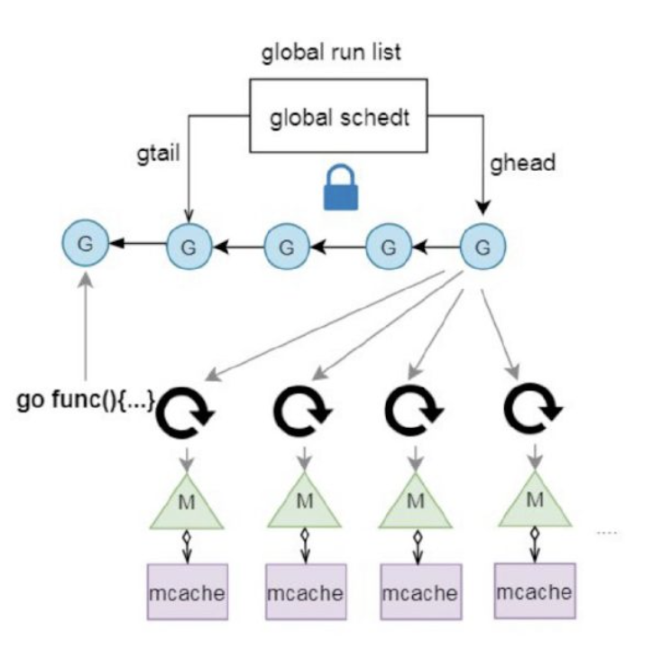
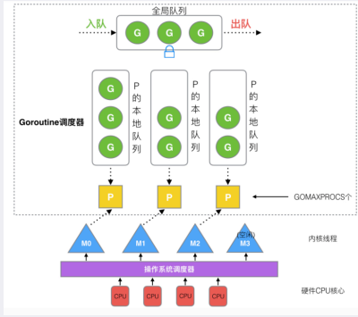
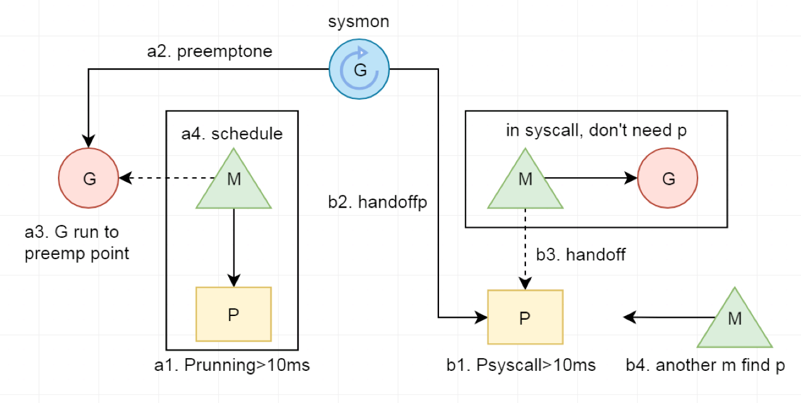

# Go调度器

## 历史版本
- **单线程调度器 0.x**
  - 只包含 40 多行代码；
  - 程序中只能存在一个活跃线程，由 G-M 模型组成
- **多线程调度器 1.0**
   - 允许运行多线程的程序；
   - 全局锁导致竞争严重
- **任务窃取调度器 1.1**
    - 引入了处理器 P，构成了目前的 G-M-P 模型；
    - 在处理器 P 的基础上实现了基于工作窃取的调度器；
    - 在某些情况下，Goroutine 不会让出线程，进而造成饥饿问题；
    - 时间过长的垃圾回收（Stop-the-world，STW）会导致程序长时间无法工作
- **抢占式调度器 1.2-至今**
    - 基于协作的抢占式调度器 - 1.2 ~ 1.13
    - 通过编译器在函数调用时插入抢占检查指令，在函数调用时检查当前 Goroutine 是否发起了抢占请求，实现基于协作的抢占式调度；
    - Goroutine 可能会因为垃圾回收和循环长时间占用资源导致程序暂停；(因为一直执行某个函数逻辑，不调用其它函数，就没办法触发抢占调度)
- **基于信号的抢占式调度器 - 1.14 ~ 至今**
  - 于信号的真抢占式调度；
  - 垃圾回收在扫描栈时会触发抢占调度；
  - 抢占的时间点不够多，还不能覆盖全部的边缘情况；
- **非均匀存储访问调度器  提案**
  - 对运行时的各种资源进行分区

## 历史模型
### GM模型

#### 模型结构
  - **G**: Goroutine
  - **M**: Machine(与os线程一一对应)
#### 缺点
  - 创建，销毁跟调度G都需要每个M获取到全局队列的锁，竞争非常激烈
  - G在线程中传递问题(如一个G创建出一个新的G，新G需要放到全局队列中，被其它线程获取执行，增大了调度延迟)
  - Per-M的内存问题,每个M都有一个cache,然而实际上只有在运行的M才需要cache，这就导致很多阻塞在系统调用的M产生了内存浪费

### GMP模型

#### 模型结构
  - **G**: Goroutine
  - **P**: processor 处理器
    - 数量: 默认情况下就是你CPU核心数个P(超线程下就是2倍)，可配置
    - 本地队列: 
      - 存放等待运行的G
      - 最多拥有256G
  - **M**: Machine(与os线程一一对应)
- **对比GM改变**
  - 把mcache移动到了P中
  - 不再是都用全局的G队列了，每个P都有自己的G队列，新的G优先放入到自己的队列中，满了后再批量放到全局队列中，优先从自己的本地队列中获取G执行
  - 实现了work stealling,当某个P的队列中没有可运行的G时，可以从全局队列，或者其它P中获取G执行
  - 当因为网络或者锁进行切换时，G与M分离，M通过调度执行新的G(异步阻塞,M可以继续执行其它任务)
  - 当因为系统调用阻塞或cgo运行一段时间后，sysmon协程会将P与M分离，由其它的M与P绑定，执行P中的G

#### 调度策略
  - **线程复用**: 避免频繁的创建跟销毁线程，而是复用线程
      - **hand off机制** : 当前的正在执行的G进行系统调用阻塞线程时，让P跟M解绑，把P转移给其它空闲的线程执行
      - **work-stealing**: 当某个P的队列中没有可运行的G时，可以从全局队列，或者其它P中获取G执行
      - **利用并行**: 最多有GOMAPXPROCS个线程分布在多个CPU上运行
      - **抢占**: 通过抢占式调度，一个Goroutine最多运行10ms，防止其它Goroutine饿死
      - **全局G队列**: 本地队列为空时候先从全局队列获取G
#### 监控线程sysmon
      
##### 执行间隔
  - 初始时时20us，运行1ms后逐渐翻倍，最后时10ms运行一次
  - 抢占成功后，恢复成20us
##### 工作内容
  - 打印调度信息：如果开启schdule trace的debug信息(例如GODEBUG=schedtrace=5000,scheddetail=1), 则按照给定的间隔打印调度信息
  - 定时从 netpoll 中获取 ready 的协程: 每sysmon tick进行一次netpoll(在STW结束和M执行查找可运行的G时也会执行netpoll)获取fd事件, 将与之相关的G放入全局runqueue
  - 调度等待执行的timer，把空闲的M和P来执行timer任务
  - 如果GC两分钟都没有运行的话，强制执行GC
  - 执行抢占
    - 系统调用，P跟M进行脱离
    - 非系统调用，通知抢占(执行时间大于10ms的G)
  - 归还内存：每5分钟归还GC后不再使用的span给操作系统(scavenge)

# 引用
- https://www.ardanlabs.com/blog/2018/08/scheduling-in-go-part1.html
- https://zhao520a1a.github.io/2020/09/10/Go%E8%B0%83%E5%BA%A6%E7%AF%87/
- https://learnku.com/articles/41728
- https://www.zhihu.com/question/20862617
- https://morsmachine.dk/go-scheduler
- https://draveness.me/golang/docs/part3-runtime/ch06-concurrency/golang-goroutine/